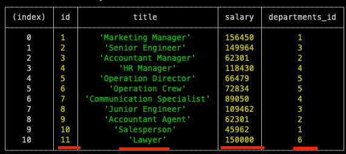

12. SQL Challenge: Employee Tracker

## Description 

Hi, 

AS A business owner
YOU WANT to be able to view and manage the departments, roles, and employees in your company
SO THAT YOU can organize and plan my business

## Table of Contents (Optional)

* [Installation](#installation)
* [Usage](#usage)
* [Technology](#technology)
* [Credits](#credits)
* [License](#license)

## Installation

- Please visit Website https://richardyjkim.github.io/employee-tracker

## Usage 

- Here you organized inquirer which nevigates you to where you want to be

- When you select View All department, it will show you All the department you company currently has.

- When you select View All Roles, it will show tou all the postion you company currently has 

- When you select View All Managers, it will show tou all the mangers you company currently working 

- When you select View All employee, it will show tou all the employee you company currently working including thier roles, department, salary and mangers they will report to

- When you select add Department, type the department you wish to add, let's add legal department.
- it will give department new id of 6 and added to current data

- When you select add roles, type a role you wish to add and its salary and department id. lets add lawyer to our new created department 'legal' which we generate department id as an 6, and salary of 150000
- it will be added to our current data as well

- When you select add employee, type the new hired one first and last name and thier role, and their manager, and thier department and lastly thier salary
- Lets add 'Wendy Watson' to our company. All of her data is included to your company's database

- When you select update employee, lets update our new hired one Wendy to diffrent department
- Her roles was a operation crew which belongs to operation deparment( id#5), now she is relocated to communication specailst which belongs to HR department (role id#7)

- Further Details please watch Demo Video

## Technology
    - Express
    - Npm
    - Java Script
    - nodejs
    - inquirer
    - Mysql2
    - Mysql workbench

## Credits

 - Richard Kim: richardyjkim (github)

## License

MIT License

Copyright (c) [2021] [Richard Y Kim]

Permission is hereby granted, free of charge, to any person obtaining a copy
of this software and associated documentation files (the "Software"), to deal
in the Software without restriction, including without limitation the rights
to use, copy, modify, merge, publish, distribute, sublicense, and/or sell
copies of the Software, and to permit persons to whom the Software is
furnished to do so, subject to the following conditions:

The above copyright notice and this permission notice shall be included in all
copies or substantial portions of the Software.

THE SOFTWARE IS PROVIDED "AS IS", WITHOUT WARRANTY OF ANY KIND, EXPRESS OR
IMPLIED, INCLUDING BUT NOT LIMITED TO THE WARRANTIES OF MERCHANTABILITY,
FITNESS FOR A PARTICULAR PURPOSE AND NONINFRINGEMENT. IN NO EVENT SHALL THE
AUTHORS OR COPYRIGHT HOLDERS BE LIABLE FOR ANY CLAIM, DAMAGES OR OTHER
LIABILITY, WHETHER IN AN ACTION OF CONTRACT, TORT OR OTHERWISE, ARISING FROM,
OUT OF OR IN CONNECTION WITH THE SOFTWARE OR THE USE OR OTHER DEALINGS IN THE
SOFTWARE.

© 2021 Trilogy Education Services, LLC, a 2U, Inc. brand. Confidential and Proprietary. All Rights Reserved.
